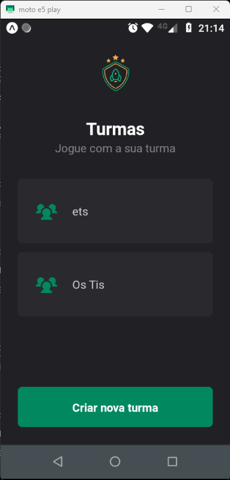
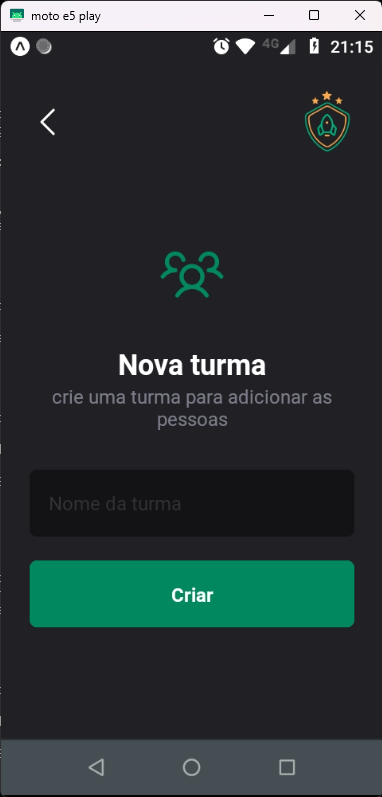
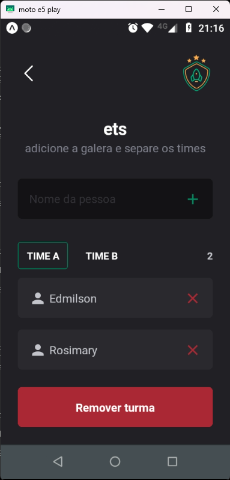

# team
Este aplicativo, de código aberto (licença MIT), é de caráter educativo, totalmente funcional e tem a finalidade de cadastrar turmas de amigos e organizar times para disputas de games. Apesar da aparente simplicidades, seu desenvolvimento exige a utilização de conceitos primordiais para o desenvolvimento de aplicativos móveis. 


## techs
Abaixo está a relação das principais tecnologias utilizadas

- react native
- react navigation
- typescripet
- local store
- expo
- styled components

## features

### Turmas
Selecione ou cadastre suas turmas com as quais deseja compartilhar suas batalhar e conquistas nos seus games preferidos.





### 
Cadastre e organize suas turmas de forma simples e rápida.



### Times
Cadastre os participantes dos times concorrentes.



## Pré-requisitos

Esta excelente documentação da [Rocketseat](https://www.rocketseat.com.br/) contém as informações necessárias para a criação do ambiente onde será possível a utilização e/ou aperfeiçoamente deste App. <https://react-native.rocketseat.dev>

- node
- npm
- expo
- emulador

## Clonar e executar o projeto

Com o emulador rodando, execute os seguintes comandos:

```
git clone https://github.com/esbnet/ignite-native-team.git

cd ignite-native-team

npm install

npx expo start

```
<br>
<br>

<center> 

Este projeto faz parte do curso Ignite da 

.
</center>